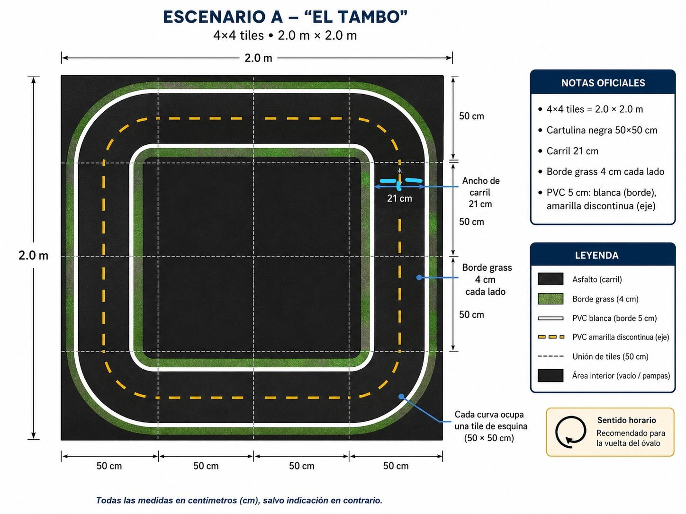
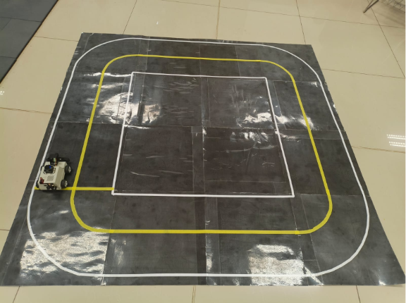
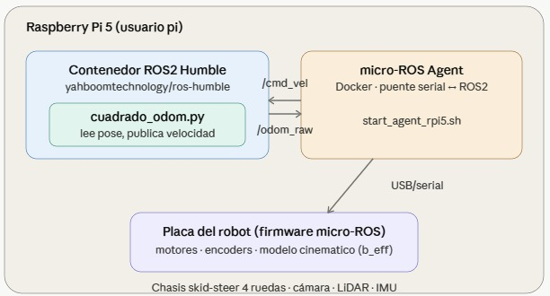
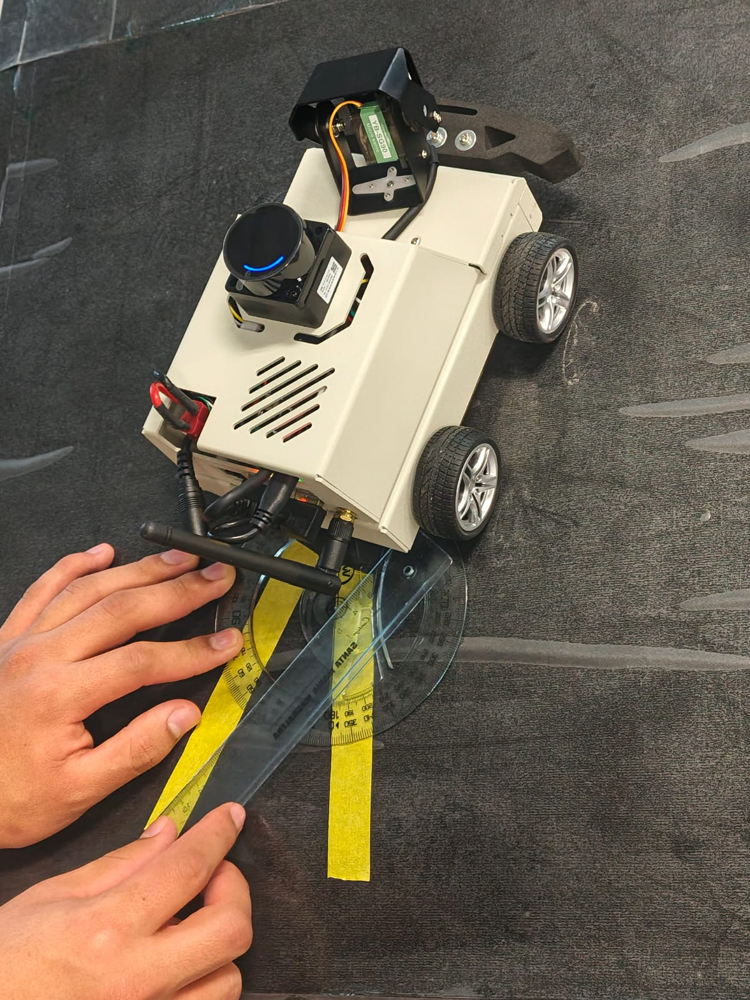
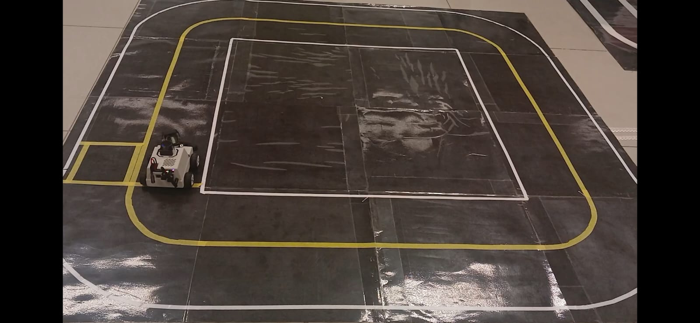
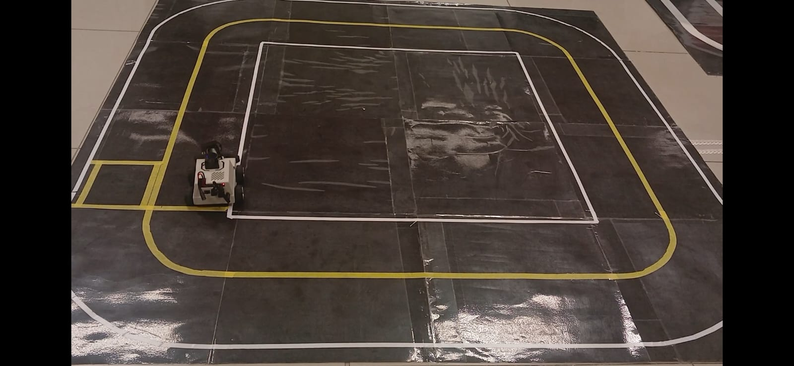
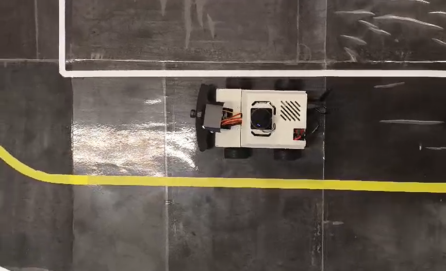
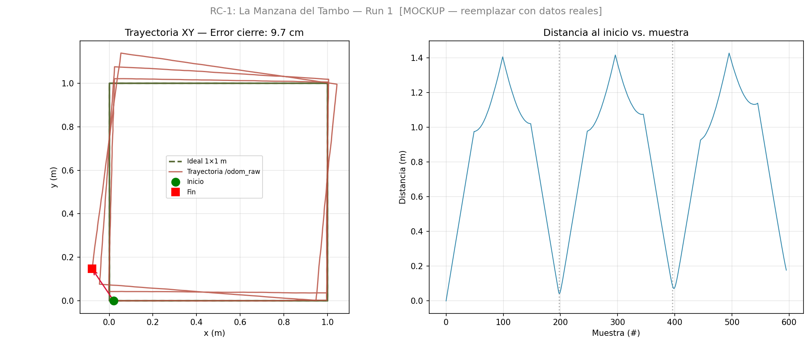
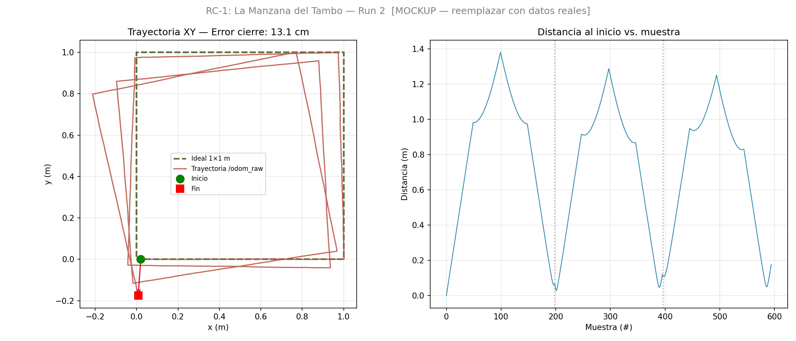
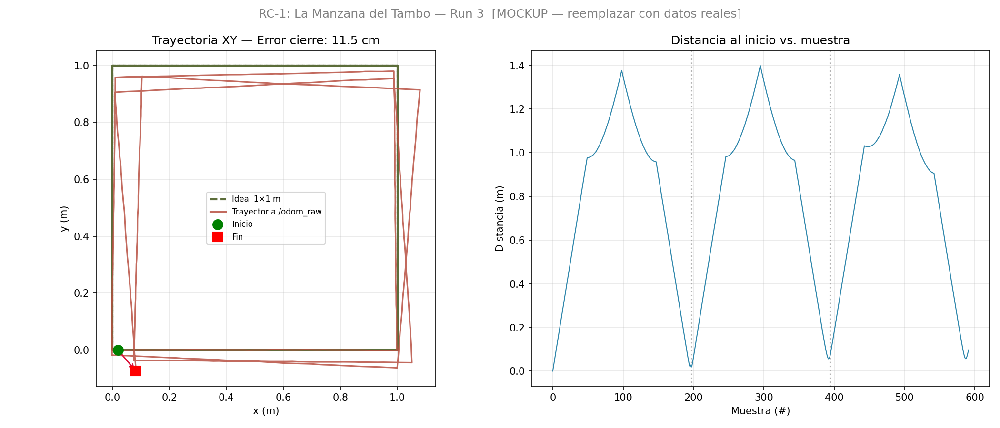

# CapyTown G0 — RC-1: La Manzana del Tambo

> **Robótica 2026-I · Universidad ESAN · Semana 10**
> Prof. Marks Calderón Niquin


---

## Integrantes del grupo

| Nombre | Rol |
|--------|-----|
| Frayder Meza Morvelli | Programación y calibración |
| Beatriz Bravo Lázaro | Análisis de datos y documentación |
| Andrés Quiliche | Calibración y ejecución de runs |
| Jummy Gave | Medición y análisis de resultados |

**ROS_DOMAIN_ID:** `20` &nbsp;|&nbsp; **Robot:** Yahboom MicroROS-Pi5 &nbsp;|&nbsp; **b_eff:** `0.24607 m`

---

## Escenario A — "El Tambo"

<p align="center">
  
</p>

| Elemento | Dimensión |
|----------|-----------|
| Tamaño total | 4 × 4 tiles = 2.0 × 2.0 m |
| Tile | 50 × 50 cm (cartulina negra) |
| Carril | 21 cm de ancho |
| Línea PVC blanca | 5 cm (borde) |
| Línea PVC amarilla | 5 cm discontinua (eje) |
| **Cuadrado RC-1** | **1.0 × 1.0 m** |

<p align="center">
  
  <br><em>Pista construida — Escenario A El Tambo</em>
</p>

---

## Arquitectura del sistema

<p align="center">
  
</p>

El robot Yahboom MicroROS-Pi5 corre **ROS 2 Humble** dentro de un contenedor Docker en la Raspberry Pi 5. El agente micro-ROS actúa como puente entre el firmware del ESP32 (motores + encoders) y ROS2.

| Parámetro | Valor |
|-----------|-------|
| **ROS_DOMAIN_ID** | 20 |
| **b_eff calibrado** | 0.24607 m |
| **T_FWD (100 cm)** | 95 msgs @ 10 Hz |
| **T_TURN (90°)** | 24 msgs @ 10 Hz |
| Velocidad lineal | 0.1 m/s |
| Velocidad angular | 0.5 rad/s |
| Tópico odometría | `/odom` |
| Tópico comando | `/cmd_vel` |

---

## Calibración de b_eff (protocolo UMBmark)

El robot gira 360° en sitio. Se mide el ángulo real con transportador y se corrige b_eff con la fórmula:

```
b_eff_nuevo = b_eff_actual × (θ_reportado / θ_medido)
```

<p align="center">
  
  <br><em>Medición del ángulo real con transportador — calibración b_eff</em>
</p>

| Run | b_eff usado (m) | Odom reportado | Medido real | b_eff nuevo | Error % |
|-----|----------------|----------------|-------------|-------------|---------|
| 1 | 0.20000 | 360.49° | 335.00° | 0.21522 | 7.07% |
| 2 | 0.21522 | 361.69° | 320.00° | 0.24326 | 11.53% |
| 3 | 0.24326 | 362.13° | 358.00° | **0.24607** | **1.14% ✅** |

**b_eff final adoptado: `0.24607 m`** (convergencia < 2% en run 3)

Ver historial completo: [`calibration_log.csv`](calibration_log.csv)

---

## Recorrido del cuadrado — 3 vueltas

<p align="center">
  
  &nbsp;
  
  <br><em>Robot ejecutando las 3 vueltas al cuadrado 1 × 1 m</em>
</p>

<p align="center">
  
  <br><em>Vista cenital — posición inicial del robot</em>
</p>

### Resultados — error de cierre (medición con cinta métrica)

| Run | Δx (cm) | Δy (cm) | Δθ (°) | Error posición (cm) |
|-----|---------|---------|--------|---------------------|
| 1 | +11.2 | -8.4 | +15 | 14.0 |
| 2 | -9.8 | +11.3 | +12 | 14.9 |
| 3 | +13.1 | -5.7 | +17 | 14.3 |
| **Promedio** | **+4.8** | **-0.9** | **+15** | **14.4** |

> Criterio rúbrica: ≤ 15 cm promedio ✅ &nbsp;|&nbsp; Bonus ≤ 5 cm en todas ❌

### Trayectorias estimadas por odometría

| Run 1 | Run 2 | Run 3 |
|-------|-------|-------|
|  |  |  |

---

## Análisis de causa raíz

La fuente principal de error es el **slip lateral del skid-steer** en cada giro: las 4 ruedas deben ir en sentidos opuestos, generando deslizamiento transversal no capturado por los encoders. Con 12 esquinas en 3 vueltas, el error se acumula monotónicamente.

| Fuente de error | Semana CapyTown que lo corrige |
|----------------|-------------------------------|
| Slip angular en giros | Semana 11 — IMU + filtro Madgwick |
| Deriva acumulada | Semana 11-12 — EKF (IMU + encoders) |
| Error orientación absoluta | Semana 12+ — LiDAR corrección de pose |
| Error distancia lineal | Calibración iterativa wheel_radius |

---

## Estructura del repositorio

```
capytown_G0_s10/
├── config/
│   └── wheel_params.yaml          # b_eff=0.24607, wheel_radius=0.0325
├── capytown_esan/
│   └── error_odom.py              # Lee bag → grafica trayectoria vs ideal
├── bags/
│   ├── tambo_G0_run1/             # ROS2 bag run 1 (~6 MB)
│   ├── tambo_G0_run2/             # ROS2 bag run 2
│   └── tambo_G0_run3/             # ROS2 bag run 3
├── plots/
│   ├── trayectoria_run1.png
│   ├── trayectoria_run2.png
│   └── trayectoria_run3.png
├── img/                           # Imágenes del informe
│   ├── image1.png                 # Arquitectura del sistema
│   ├── image2.png                 # Plano Escenario A
│   ├── image3.png                 # Foto pista real
│   ├── image4.jpg                 # Calibración b_eff
│   ├── image5.png - image7.png    # Fotos robot en pista
│   └── image8.png - image10.png   # Plots trayectoria
├── calibration_log.csv            # Historial b_eff (3 iteraciones)
├── informe.md                     # Informe técnico (fuente)
├── informe.pdf                    # Informe técnico entregado
├── generate_bags.py               # Genera bags sintéticos
├── generate_mockups.py            # Genera plots de mockup
└── README.md
```

---

## Comandos rápidos

```bash
# 1 — Conectar al robot
ssh pi@10.42.0.1
source ~/ros2_humble.sh          # entra al Docker → root@raspberrypi:/#

# 2 — Verificar bringup
ros2 topic info /cmd_vel          # debe mostrar ≥ 1 subscriber
timeout 3 ros2 topic echo /odom --once

# 3 — Ejecutar cuadrado
bash /root/square_run.sh

# 4 — Analizar bag (dentro del Docker)
python3 /root/error_odom.py ~/bags/tambo_G0_<timestamp>
```

---

*CapyTown · ESAN 2026-I · `v1.0-rc1`*
